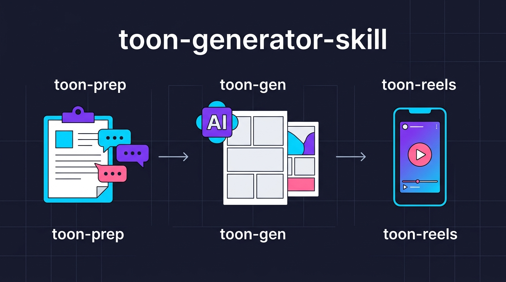
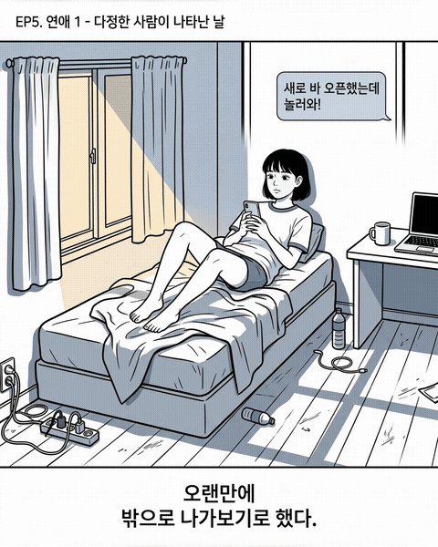

# toon-generator



> 인스타툰 제작의 전체 파이프라인을 자동화하는 Claude Code 플러그인

[English](README.en.md)

<details>
<summary>Demo (결과물 미리보기)</summary>



</details>

### 이런 걸 할 수 있어요

1. 아이디어만 있으면 AI가 질문하며 기획을 잡아줍니다 (캐릭터, 스토리, 아트 스타일)
2. 기획을 바탕으로 에피소드별 웹툰 이미지를 자동 생성합니다
3. 생성된 이미지를 인스타그램 릴스 영상으로 변환합니다

```
toon-prep               toon-gen                toon-reels
(기획 준비)       -->   (이미지 생성)     -->   (릴스 영상)

 AI 인터뷰               레퍼런스 탐색            슬라이드 조합
   |                       |                       |
 문서 자동 생성            품질 검수                BGM 합성
   |                       |                       |
 참고 이미지 생성          Gemini로 그리기          MP4 출력
```

### 포함된 스킬 & 에이전트

| 스킬 | 한 줄 설명 |
|------|-----------|
| **toon-prep** | AI 인터뷰로 기획 수집 -> 캐릭터/콘티/아트디렉션 문서 자동 생성 -> 참고 이미지 생성 |
| **toon-gen** | 참고 이미지 탐색 -> 품질 검수 -> Gemini API로 웹툰 이미지 생성 |
| **toon-reels** | 슬라이드 이미지 -> 페이드 전환 + BGM -> 인스타 릴스 MP4 |

| 에이전트 | 소속 스킬 | 역할 |
|---------|----------|------|
| **story-writer** | toon-gen | 콘티/에피소드 설계 기반 이미지 프롬프트 JSON 생성 |
| **reference-explorer** | toon-gen | 슬라이드별 참고 이미지 탐색/추천 |
| **interviewer** | toon-prep | 소크라테스식 인터뷰로 기획 정보 수집 |
| **doc-generator** | toon-prep | 인터뷰 결과 기반 콘텐츠 문서 자동 생성 |

### 설치

#### 플러그인 설치 (권장)

```bash
# 프로젝트 로컬에 클론 후 플러그인으로 등록
git clone https://github.com/anomie7/toon-generator.git .claude/plugins/toon-generator
cd .claude/plugins/toon-generator && npm install
```

```bash
# 또는 글로벌 설치 (모든 프로젝트에서 사용)
git clone https://github.com/anomie7/toon-generator.git ~/.claude/plugins/toon-generator
cd ~/.claude/plugins/toon-generator && npm install
```

설치 후 Claude Code가 자동으로 `skills/`의 3개 스킬과 `agents/`의 4개 에이전트를 인식합니다.

### 사전 조건

1. **GEMINI_API_KEY**: [Google AI Studio](https://aistudio.google.com/)에서 무료로 발급받을 수 있습니다

   ```bash
   export GEMINI_API_KEY="your-key-here"
   ```

2. **Node.js >= 18**

3. **ffmpeg** (toon-reels 사용 시):

   ```bash
   brew install ffmpeg  # macOS
   ```

### 사용법

#### 1단계: 콘텐츠 준비 (toon-prep)

```bash
# 인터뷰부터 시작 (전체 파이프라인)
/toon-prep --content-dir ./content

# 이미 기획이 있으면 문서 생성부터
/toon-prep --content-dir ./content --skip-interview

# 레퍼런스 이미지만 생성
/toon-prep --content-dir ./content --skip-interview --skip-docs
```

toon-prep이 완료되면 다음이 생성됩니다:

```
content/
  interview-result.json          # 인터뷰 결과
  character-sheet.md             # 캐릭터 시트
  character-concept.md           # 인물 컨셉
  visual/
    art-direction.md             # 아트 디렉션
    character-sheet-detailed.md  # 상세 캐릭터 시트
    references/                  # 레퍼런스 이미지 (7종)
  episode-design/EP1.md~         # 에피소드 설계
  conti/EP1.md~                  # 콘티
```

#### 2단계: 이미지 생성 (toon-gen)

```bash
# EP1 전체 생성
/toon-gen --episode 1

# 특정 슬라이드만
/toon-gen --episode 3 --slide 2

# 프로덕션 모델로 생성
/toon-gen --episode 1 --model gemini-3-pro-image-preview

# 생성 직후 자동 검수
/toon-gen --episode 1 --auto-inspect
```

#### 3단계: 릴스 영상 (toon-reels)

```bash
# 기본 (4:5, 3초/슬라이드)
/toon-reels output/EP1

# BGM 포함
/toon-reels output/EP1 --bgm content/audio/EP1/bgm.mp3

# 릴스용 세로 비율 + 페이드 전환
/toon-reels output/EP1 --ratio 9:16 --fade 0.5
```

### 모델 자동 선택

`toon-gen`은 슬라이드의 텍스트 유무에 따라 모델을 자동 선택합니다:

| 조건 | 모델 | 이유 |
|------|------|------|
| 한글 텍스트 있음 | `gemini-3-pro-image-preview` (Pro) | 한글 렌더링 정확도 우수 |
| 텍스트 없음 | `gemini-3.1-flash-image-preview` (Flash) | 빠르고 저렴 |

`--model`로 고정 지정하면 자동 선택을 무시합니다.

<details>
<summary>아키텍처 / 커스터마이징 (개발자용)</summary>

### 아키텍처

```
toon-generator/
  .claude-plugin/
    plugin.json                 # 플러그인 메니페스트

  agents/                       # 서브에이전트 (자동 발견)
    story-writer.md             # 이미지 프롬프트 생성
    reference-explorer.md       # 참고 이미지 탐색/추천
    interviewer.md              # AI 인터뷰
    doc-generator.md            # 문서 자동 생성

  skills/                       # 스킬 (자동 발견)
    toon-prep/
      SKILL.md
      scripts/
        generate-refs.ts        # 참고 이미지 생성 (Gemini API)
      templates/                # 문서 템플릿 (9종)

    toon-gen/
      SKILL.md
      scripts/
        generate.ts             # 이미지 생성 (Gemini API)
        inspect.ts              # 이미지 품질 검증 (Gemini API)
      lib/
        config.ts               # 설정 + 모델 레지스트리
        types.ts                # 타입 정의 (Zod 스키마)
        image-utils.ts          # 이미지 유틸리티

    toon-reels/
      SKILL.md
      scripts/
        make-reels.sh           # ffmpeg 기반 영상 생성
```

### 커스터마이징

- **문서 템플릿**: `skills/toon-prep/templates/*.tmpl.md`를 수정하면 생성되는 문서 구조를 변경할 수 있습니다
- **아트 디렉션**: `content/visual/art-direction.md`에 스타일/금지 요소를 정의하면 모든 프롬프트에 자동 반영됩니다
- **에이전트 프롬프트**: `agents/*.md` 파일을 수정하여 에이전트 동작을 조정할 수 있습니다

</details>

### Roadmap

- [ ] Remotion 기반 고급 릴스 (애니메이션, Ken Burns 효과)
- [ ] 슬라이드별 텍스트 길이에 따른 자동 duration 조절
- [ ] 자동 BGM 선택 연동
- [ ] 에피소드 간 자동 스타일 일관성 검증

### 라이선스

[MIT](LICENSE)
